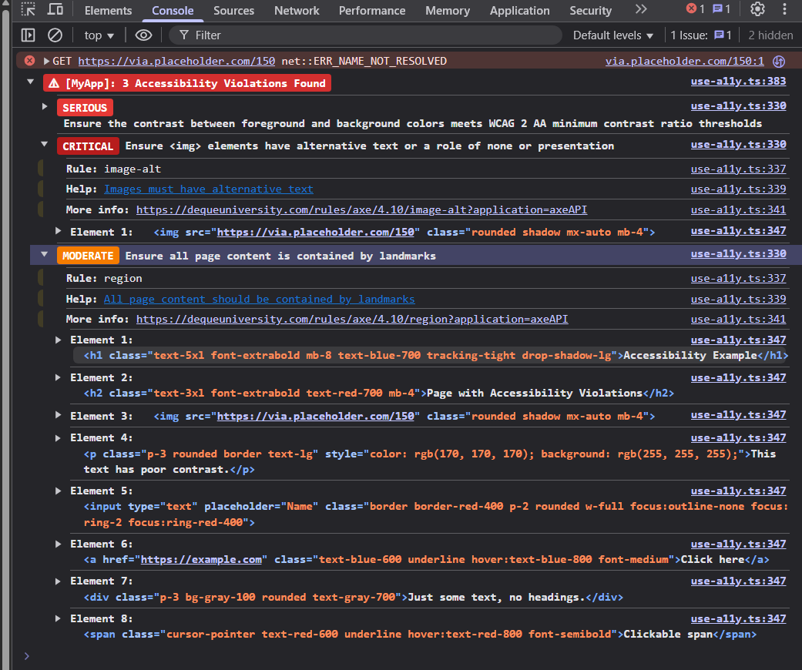

# vue-use-a11y

A Vue 3 composable for automated accessibility (a11y) testing using [axe-core](https://github.com/dequelabs/axe-core). Easily integrate accessibility checks into your Vue apps and get instant feedback on violations during development.

## Features

- Automated accessibility scans using axe-core
- Works with both `Ref` and `TemplateRef` for target elements
- Highlights violations in the DOM
- Monitors DOM changes and user interactions
- Customizable scan options and debounce
- Console logging with styled output and violation details

## Installation

```sh
npm install vue-use-a11y axe-core
```

## Usage

### Basic Example

```vue
<script setup lang="ts">
import { ref } from 'vue'
import { useA11y } from 'vue-use-a11y'

const rootRef = ref<HTMLElement | null>(null)

useA11y({
	element: rootRef, // or use a TemplateRef
	enabled: true,
	// other options...
})
</script>

<template>
	<div ref="rootRef">
		<!-- Your app content -->
	</div>
</template>
```

Once implemented, you will be able to see the all findings for accessbiliy violations on the currenlty rendered page in your browser's JavaScript console:



The scan will re-run on every update in the view. 

### Advanced Options

```ts
useA11y({
	element: rootRef,
	enabled: process.env.NODE_ENV === 'development',
	axeOptions: { rules: { 'color-contrast': { enabled: false } } },
	enableHighlighting: false,
	watchForChanges: true,
	debounceDelay: 1500,
	watchInteractions: true,
	loggerPrefix: '[MyApp]',
	initialScanDelay: 1000,
	waitForContent: false,
})
```

### Options

| Option              | Type                                         | Default      | Description                                                                 |
|---------------------|----------------------------------------------|--------------|-----------------------------------------------------------------------------|
| `element`           | `Ref<HTMLElement>` or `TemplateRef<HTMLElement>` | `document.body` | The element to test for accessibility violations                            |
| `enabled`           | `boolean`                                    | `true` (dev) | Enable/disable accessibility checking                                       |
| `axeOptions`        | `object`                                     | `{}`         | Custom axe-core configuration                                               |
| `enableHighlighting`| `boolean`                                    | `true`       | Highlight elements with violations on hover                                 |
| `watchForChanges`   | `boolean`                                    | `true`       | Monitor DOM changes and re-run checks                                      |
| `debounceDelay`     | `number`                                     | `1000`       | Debounce delay for re-running checks after DOM changes (ms)                 |
| `watchInteractions` | `boolean`                                    | `true`       | Run checks on user interactions (click, focus, etc.)                        |
| `loggerPrefix`      | `string`                                     | `undefined`  | Prefix for console log messages                                             |
| `initialScanDelay`  | `number`                                     | `2000`       | Delay before starting initial scan (ms)                                     |
| `waitForContent`    | `boolean`                                    | `true`       | Wait for meaningful content before running accessibility checks             |

## Example App

See the `/example` directory for a demo Vue app showing both accessible and inaccessible pages, styled with Tailwind CSS.

## API

The composable returns:

- `violations`: A reactive array of current accessibility violations
- `isRunning`: A reactive boolean indicating if a scan is in progress
- `runAxe()`: Manually trigger an accessibility scan
- `cleanup()`: Remove listeners and observers
- `highlightElement(element)`: Manually highlight an element
- `removeHighlight()`: Remove highlight overlay

## Contributing

Contributions, issues, and feature requests are welcome! Feel free to open an issue or submit a pull request.

## License

MIT
